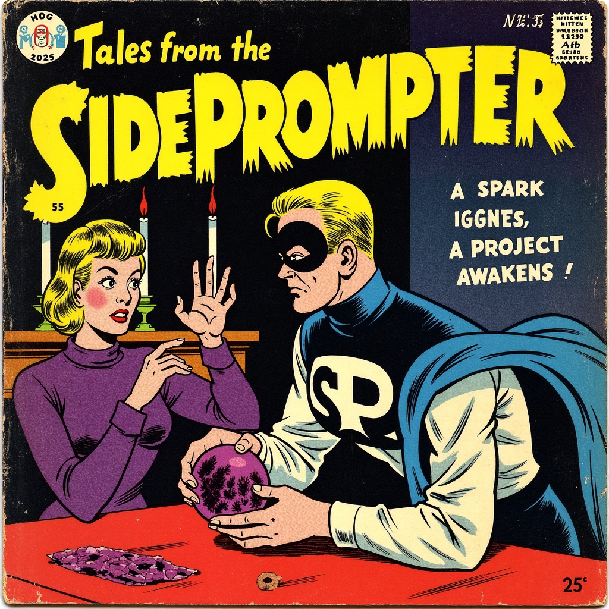

# SidePrompter

## About

SidePrompter is an AI-driven assistant that listens to your video calls in real-time, providing smart questions, background insights, and helpful advice—like a secret advisor during your conversations.

This repository contains supplementary materials, code, and documentation chronicling the journey of building SidePrompter from a proof of concept to a polished product.

## Follow the Journey

The complete development journey of SidePrompter is documented on [Substack](https://sideprompter.substack.com/), where you'll find:

- Detailed build logs and technical decisions
- AI-generated comics illustrating the process
- Insights into using AI tools for development
- Challenges and solutions encountered along the way

## Core Features

The initial version of SidePrompter aims to deliver:

- **Cross-platform Support**: Works on Windows and macOS, with potential Linux support
- **Seamless Audio Integration**: Captures audio streams from Zoom, Teams, and similar applications
- **Multi-Model Support**: Connects to various chat models (ChatGPT, Gemini, Claude, local models)
- **Real-Time Local Transcription**: Processes audio directly on the user's machine
- **Stealth Operation**: Remains invisible during screen sharing
- **Keyboard Shortcuts**: Fully controllable via keyboard for efficiency

## Repository Structure

- `/blog`: Blog posts and accompanying materials
- `/docs`: Technical documentation and architecture decisions
- More sections to be added as development progresses

## Architecture Decisions

The development follows a structured decision-making process documented in the Architecture Decision Records (ADRs) located in the `/docs/adr` directory.

## Project Status

SidePrompter is currently under active development. Check the [Substack](https://sideprompter.substack.com/) for the latest updates on progress and upcoming features.

## License

TBD

---

*SidePrompter - Your invisible AI co-pilot for better conversations*
