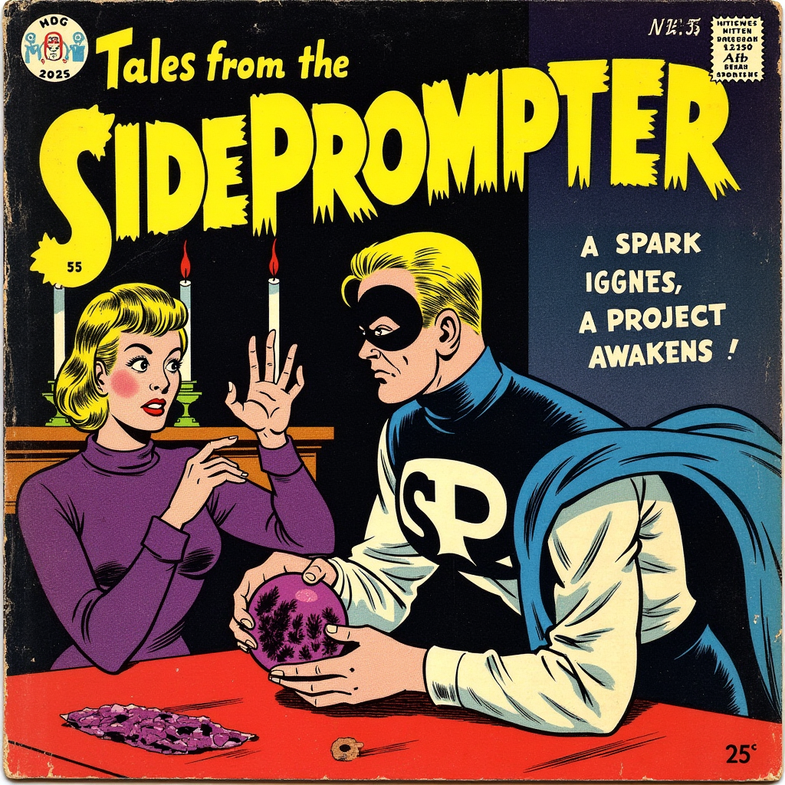

#  Tales from Side Prompter: Chapter 1 - A Spark Ignites, A Project Awakens

It's funny what sparks an idea. For me, it was the news that a startup called Cluely [raised $15M from a16z](https://techcrunch.com/2025/06/20/cluely-a-startup-that-helps-cheat-on-everything-raises-15m-from-a16z/). After looking into their product, I had a moment of déjà vu—I had built something surprisingly similar a few months ago.

Admittedly, "similar" meant an unfinished Proof of Concept (PoC) running on my local machine, but the core idea was there. For whatever reason, that news was the catalyst I needed. I decided to dust off my old project and get back to work.

This blog documents my journey of transforming Side Prompter from a forgotten PoC into a polished tool, with a unique twist: I'll be illustrating the process with AI-generated comics.



## Project Goals

I've defined the core features for the initial version as follows:
- **Cross-platform:** Must run on both Windows and macOS, with Linux as a potential addition.
- **Seamless Audio Access:** Needs to integrate with the audio streams of calls in Zoom, Teams, and similar applications.
- **Multi-Model Support:** Should allow users to connect various chat models, including ChatGPT, Gemini, Claude, local models, and more.
- **Real-Time Local Transcription:** Must transcribe audio in real-time, directly on the user's machine.
- **Stealth Operation:** Should not be visible during screen sharing, if possible.
- **Keyboard Shortcuts:** Must be controllable via keyboard shortcuts for efficiency.

Moreover, I plan to build this project professionally, using AI tools to accelerate the development process wherever possible. In short, this project is both about creating a useful tool and exploring the current capabilities of the AI landscape.

## The Naming Process: A Tale of Two AIs

Naming is hard üòÖ, so I turned to ChatGPT for help. I know that context is key, so my first step was to ask for help in creating a powerful naming prompt. My initial query was simple:

```
I would like to create a prompt which will help me to create a name for my project. Ask me everything you need to help me shape the prompt
```

ChatGPT's response was exactly what I needed, asking a series of questions to understand the project's identity, goals, and audience.

```
Perfect 👍 Let’s design a meta-prompt that will later generate a great project name for you.
To do this, I need to understand your **project’s identity, goals, audience, and style preferences.** I’ll ask you structured questions, then we’ll turn your answers into a reusable “naming prompt.”

Here are the key areas:

### 1. Basics

* What is the project about in one sentence?
* Is it a product, a startup, an open-source tool, a community, or something else?

### 2. Purpose & Impact

* What problem does it solve or what value does it bring?
* How do you want people to feel when they hear the name? (e.g., trustworthy, fun, futuristic, professional, playful)

### 3. Audience

* Who is the main audience (developers, enterprises, consumers, hobbyists, etc.)?
* Do you want the name to sound international/English-friendly, or local (e.g., Polish, European)?

### 4. Style & Constraints

* Do you prefer names that are:

  * Short acronyms, invented words, or descriptive names?
  * More technical or more metaphorical/poetic?
* Any words or themes you definitely want included or avoided?
* Do you need the .com (or another) domain to be available?

### 5. Practical Notes

* Should the name be easy to pronounce and spell globally?
* Do you prefer one-word names or multi-word names?

---

👉 Once you give me your answers, I’ll shape a **universal prompt template** you can reuse in the future to generate project names.

Do you want me to ask these step by step (interactive), or do you prefer a single questionnaire to fill in at once?
```

After a moment of reflection, I realized I had all the necessary information to give the process a solid foundation. After answering the questions (see the full conversation [here](https://chatgpt.com/share/68a30d80-4b6c-8009-8b97-09016ee2fda3)), I received a final prompt to generate project names:

```
I’m building an AI-driven assistant that listens to Zoom, Teams, and other calls in real time. It provides smart questions, background insights, and helpful advice — like a secret advisor, intelligent prompter, or second brain. It may start open-source but could grow into a startup.

Please generate **15–20 creative, professional, and memorable project names** that:

• Feel **trustworthy, advisory, and a bit mysterious** — like a hidden helper or confidential ally.  
• Are **easy to spell and pronounce** in English, with clear international appeal.  
• Sound **original and distinct** (but it’s okay if they evoke a familiar AI vibe).  
• Include **domain suggestions**: prioritize **.com**, but also add options with **.ai** or **.tech** where .com isn't likely available.  
• Optionally note if you think the .com may be taken and offer the strongest alternative.

For each name, provide:
1. The name itself (one- or two-word).
2. A brief explanation of the vibe or concept behind it.
3. Suggested domain options (e.g. “[Name].com”, “[Name]AI.com”, “[Name].ai”).

Also feel free to blend in the idea of "secret advisory," "quiet intelligence," or "second brain" into the name theme.
```

## Finding the Right Name

My first attempt with ChatGPT didn't quite hit the mark. Most of the suggested domains were already taken (see more [here](https://chatgpt.com/share/68a31094-265c-8009-85da-34ae5c09d376)), and the names themselves, like `Veilence` or `Obvia`, didn't resonate with me. Moreover, since I had used my tokens, I couldn't iterate further.

Instead, I tried using Gemini (see the conversation [here](https://g.co/gemini/share/92eba3e35420)) and found its suggestions to be a much better fit. I loved `EchoOS.com`, but its price as a premium domain was a deal-breaker.

After checking a few more options, I concluded that while AI might not be the perfect tool for naming, it provided excellent inspiration. That process led me to invent my own name: **SidePrompter**. The domain was available and affordable, so I went with it. Besides, Gemini seems to believe in the name:

```
The strengths of Sideprompter heavily outweigh the potential weaknesses.
```

## Next Steps

Now that I have a name and a domain, I can focus on the build. My plan involves:

1.  Creating an ADR (Architecture Decision Record) to document technology stack choices.
2.  Building an MVP (Minimum Viable Product) to test the core concept and requirements.
3.  Converting my PoC (Proof of Concept) into a fully functional product.
4.  Launching the product and gathering user feedback for future improvements.

Sound good? I hope so. See you next time!