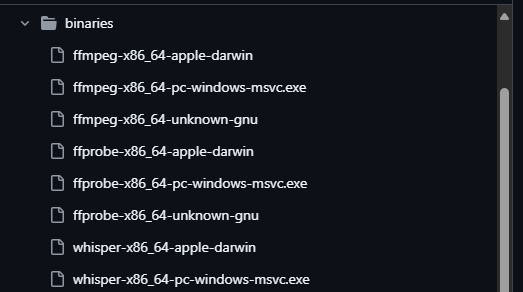

#  Tales from Side Prompter: Chapter 3 - Putting Tauri to the Test

In the [previous chapter](https://sideprompter.substack.com/p/tales-from-side-prompter-chapter-2), I created an Architecture Decision Record (ADR) to select the tech stack for SidePrompter. Tauri was the top contender.

Now, it's time to put Tauri to the test. I need to create a Proof of Concept (PoC) to validate that it can meet all the project requirements outlined in the ADR.

This part of the journey involved both successes and challenges. To capture the spirit of experimentation, I turned to AI to create this chapter's cover.


## Accessing Native APIs to Control Window Behavior

One of the key requirements is to control the window behavior, such as opening multiple windows, making them semi-transparent, and hiding them during screen sharing. While opening multiple windows is straightforward with Tauri, making a window semi-transparent and hiding it during screen sharing requires access to native APIs. Tauri provides a way to access these APIs through its Rust backend, which is essential for implementing these features.

The code is surprisingly simple (Windows example below) with almost no setup:

```rust
    #[cfg(target_os = "windows")]
    {
        use windows::Win32::UI::WindowsAndMessaging::{SetWindowDisplayAffinity, WDA_EXCLUDEFROMCAPTURE, WDA_NONE};
        unsafe {
            match window.hwnd() {
                Ok(hwnd) => {
                    let affinity = if enable { WDA_EXCLUDEFROMCAPTURE } else { WDA_NONE };
                    let result = SetWindowDisplayAffinity(hwnd, affinity);
                    if result.is_err() {
                        Err("SetWindowDisplayAffinity failed (Windows)".to_string())
                    } else {
                        Ok(format!("{}", if enable { "WDA_EXCLUDEFROMCAPTURE" } else { "WDA_NONE" }))
                    }
                },
                Err(e) => Err(format!("Failed to get hwnd (Windows): {}", e)),
            }
        }
    }
```

Just watch the video below to see it in action!

<video controls>
  <source src="./images/sideprompter-tauri-demo1.mp4" type="video/mp4">
</video>

This means that I can cross out four out of six requirements defined in the ADR:
- ✅ It must run on Windows and macOS. Linux is optional.
- ✅ It must allow creating multiple separate windows.
- ✅ It should support semi-transparent windows.
- ✅ It must not be visible during screen sharing using Teams, Zoom, or similar tools.
- ⬜ It must be able to access the mic and speakers to record audio for transcription.
- ⬜ It must be able to use AI models like Whisper to convert audio to text on the local machine.

I didn't explicitly test semi-transparent windows, but given how easy it was to access the native API, I'm confident it's achievable. The same applies to macOS; although I don't have a Mac for testing at the moment, the principles should be similar.

👉 The native integration seems almost too easy. Have you found any hidden "gotchas" with Tauri's native API access on either Windows or macOS? Let me know in the comments.

Now, it's time to test the remaining requirements.

## Whisper Integration

According to my research, the best option is to use [whisper_rs](https://docs.rs/whisper-rs/latest/whisper_rs/). Adding the reference is a piece of cake:

```toml
[dependencies]
whisper_rs = "0.1"
```

Unfortunately, it's really hard to compile. After a few hours and downloading half of the internet, I still couldn't get it to work.

To compile it, you need to have the following dependencies installed (see more: [official BUILDING.md](https://codeberg.org/tazz4843/whisper-rs/src/branch/master/BUILDING.md)):

- Visual Studio with Desktop C++ and Clang enabled (this includes the Windows SDK and all necessary components)
- CMake
- LLVM (Clang)

If you want to use the GPU for inference, you also need to install the CUDA Toolkit.

To be honest, I forgot how hard it is to compile C++ code or maybe it's just me. But I realized that I forgot a crucial aspect in my ADR: will it be easy to run CI/CD pipelines with these dependencies? Especially when my PoC in .NET, which runs Whisper without any problems, is still only around 250 lines of code.

👉 This compilation hurdle was a good reminder that the "developer experience" includes the entire toolchain. Have you faced similar C++/Rust integration challenges? How did you handle the CI/CD pipeline complexity? If you can help me I will welcome you with open arms.

## Am I the Only One?

I started to dig into different approaches. First, I found a [Genspark page](https://www.genspark.ai/spark/using-whisper-model-in-tauri-apps/aa7f0cea-77e6-4b80-9051-943c58bc9ac3) with a link to [xtify-whisper](https://github.com/Sherlockouo/xtify-whisper)—a GUI for Whisper built with Tauri, React, TypeScript, and Tailwind. It's blazing fast and small. And that is exactly what I was looking for: a Tauri app that uses Whisper. But to my surprise, it uses FFmpeg under the hood instead.



When I dug into the code, I found out that it is using FFmpeg as a sidecar process to handle audio recording and playback. This means I can use FFmpeg's capabilities without adding complex audio processing code to the Rust backend. But is it the right approach? I'm not sure yet, but it's definitely worth exploring, especially since the incoming FFmpeg 8.0 will bring native support for [whisper.cpp](https://github.com/ggml-org/whisper.cpp) bindings (see [documentation in this commit](https://git.ffmpeg.org/gitweb/ffmpeg.git/blob/13ce36fef98a3f4e6d8360c24d6b8434cbb8869b:/doc/filters.texi)).

👉 The FFmpeg sidecar approach seems like a clever workaround, especially with native Whisper support on the horizon. What do you think? Is this a solid strategy or a temporary hack?

## Should I Stay or Should I Go?
Because of the problems with compilation, I was looking for alternatives. Like how to use .NET in Tauri (I know, but I was desperate to find a solution 😅). It looks like I'm not the only one, and such a project exists: [TauriNET](https://github.com/RubenPX/TauriNET). What's more, it will be discontinued because Tauri will support C# and other languages in the future. On the official [Tauri web page](https://v2.tauri.app/about/philosophy/#polyglots-not-silos), we can find that:

> Today, Tauri uses Rust for the backend - but in the not too distant future, other backends like Go, Nim, Python, Csharp, etc. will be possible. This is because we are maintaining the official Rust bindings to the webview organization and plan to let you switch out the backend for your needs. Since our API can be implemented in any language with C interop, full compliance is only a PR away.

## Next Steps

This PoC was an informative, if challenging, exercise. While Tauri excelled at native window control, the challenges with the audio transcription component are a major roadblock. It's clear that my initial ADR needs a second look.

That's not to say Tauri is out of the running. It doesn't look bad, and the sidecar integration approach (like in `xtify`) is a solid idea. Still, I believe it's worth exploring alternatives to make an informed decision. We'll see where this journey leads me.

Here's the plan:
1.  **Re-evaluate the ADR:** I'll revisit the other top contenders, paying closer attention to the ease of integrating audio processing and local AI models.
2.  **PoC for the Runner-Up:** The next step will be to build a similar PoC for the second-best option from the ADR.
3.  **Focus on the Core Problem:** The main goal is to get a working end-to-end prototype. The technology is a means to that end, not the end itself.

👉 This pivot is a key part of the development journey. Do you agree with this course correction? Which technology from the original list do you think I should try next?