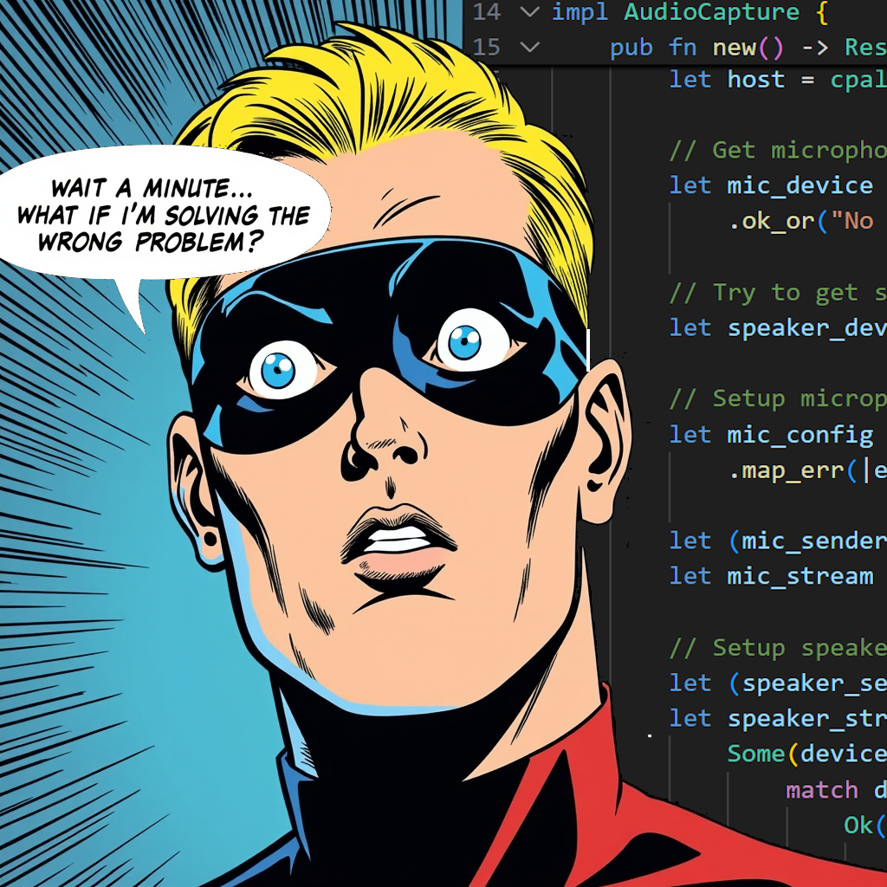

# Tales from Side Prompter: Chapter 4 - The macOS Audio Problem and the Sidecar Solution

*This week's progress: 1% success, 99% learning what not to do. 🤦*

In the [previous chapter](https://sideprompter.substack.com/p/tales-from-side-prompter-chapter-3), I was happy about my working Proof of Concept with Tauri and Rust. I had a basic UI, and everything looked good. The next step was to work on a core feature of Side Prompter: recording system audio. But this "next step" turned into a huge problem that consumed my entire week.

But before we dig into the details, let's set the scene with this week's comic art.

A full cover felt wrong for this chapter because the real story wasn't an epic fight; it was a sudden plot twist that happened inside my own head. So instead, I'm presenting a single, dramatic panel. It's an extreme close-up on the exact moment the light bulb went on, and I asked myself the most important question of the week: *"Wait a minute... what if I'm solving the WRONG problem?"*

### The Challenge: Hearing the System's Audio

The goal is simple: Side Prompter needs to listen to audio from calls on Zoom, Teams, or other apps. This means capturing the computer's output sound, not just the microphone. On Windows, this is easier to solve with APIs like WASAPI. On macOS, it is much more difficult. Of course it is.

My first research, with help from AI assistants, always suggested one solution: **BlackHole**. This is a popular virtual audio driver, but the user must install and set it up manually. For a product that should be easy to use, this is not a good option. I knew apps like Zoom and Teams could record audio without extra steps, so it was possible. But how?

### The Process & The Journey: A Story of Mistakes

Here is where I made my first big mistake 🤦: **I started developing on Windows first.** My success with WASAPI on Windows gave me the wrong idea about how to do it on macOS.

I spent three days trying to solve this. My AI coding assistants were not very helpful. When I asked how to capture system audio on macOS, the answers were almost always about the microphone or BlackHole. I even ran a search just now to prove the point, and sure enough, BlackHole was the top suggestion. You can see the results for yourself [here](https://www.perplexity.ai/search/i-would-like-to-implement-reco-CLmSeoBRRa2Pzz5ufI4tGA). The funny part? The same search result mentions AudioTee (the final solution), but if you change the search to include the mic and speaker, it suggests the old BlackHole solution again. This shows how AI can sometimes send you in the wrong direction.

I became very frustrated. I was trying to work with audio in Rust (a language I am still learning) on an operating system I don't use every day. It was very difficult to make progress. After many failed attempts, I was ready to throw my hands up and abandon the Tauri/Rust stack completely.

So, I did what any frustrated developer would do: I blamed the technology and decided to switch. I ran back to the warm, familiar comfort of .NET. I was back in the .NET world, but I still needed to pick a UI framework. In a comment on a previous post, Paweł from [Beehacks](https://beehacks.substack.com/) had suggested I look into Avalonia. But of course, I had to make another mistake first. I decided to try .NET MAUI, only to discover after a few hours that it targets Mac Catalyst, not the full macOS experience I need. So, I finally took Paweł's advice and gave Avalonia a try. The UI will be simple anyway. Famous last words, right?

👉 **Have you ever changed your technology because you were frustrated, but the problem was something else? I would love to hear your story.**

The change felt good. I was making progress! Or so I thought. I was still trying to solve the problem in the wrong way. The real issue wasn't Rust vs. .NET; it was my method for macOS audio.

Then, just as I was about to lose all hope, a little light appeared. ✨ After asking an AI assistant again with different words, it casually suggested a library I had not seen before: **AudioTeeJS**.

It's a small Node.js library that uses a command-line tool called `AudioTee`. This tool does one thing very well: it captures the macOS audio.

The solution was not to write complex native code in Rust or C#. It was to use a "sidecar"—a small, separate command-line tool that does the difficult, platform-specific work. My application can simply run this tool and listen to the audio stream it sends. This is a simple pattern that separates the main application from the difficult platform details.

### "Engage with me"

👉 **What do you think about using sidecar CLI tools instead of native libraries for cross-platform apps? Is it a smart shortcut, or will it cause maintenance problems later?**

### Conclusion & Next Steps

This week was a difficult but important lesson. The most important thing I learned is how useful the Sidecar pattern is. Instead of trying to build something that already exists, I can use a special tool that has already solved the problem. It shows that sometimes the best solution is to not write the code yourself.

I also learned that using a familiar technology helps you work faster, but it can't fix a wrong approach. The problem was never Tauri or .NET; it was my lack of knowledge about macOS.

So, what's next?

1.  **Integrate AudioTeeJS:** I will add the sidecar tool to my .NET application.
2.  **Global Hotkeys:** I need to add support for global keyboard shortcuts for quick actions.
3.  **Active Window Text:** I will try to use the accessibility APIs to get text from the active window.
4.  **Test, Test, Test:** I need to thoroughly test all the new pieces:
    *   Is the audio capture robust on macOS & Windows?
    *   Do the global hotkeys work without problems?
    *   Is it possible to do the text capture from different applications?

My plan changed unexpectedly, but I feel I am making good progress again. The goal of a cross-platform MVP seems possible again.

Thanks for following my journey. Stay tuned for the next chapter!