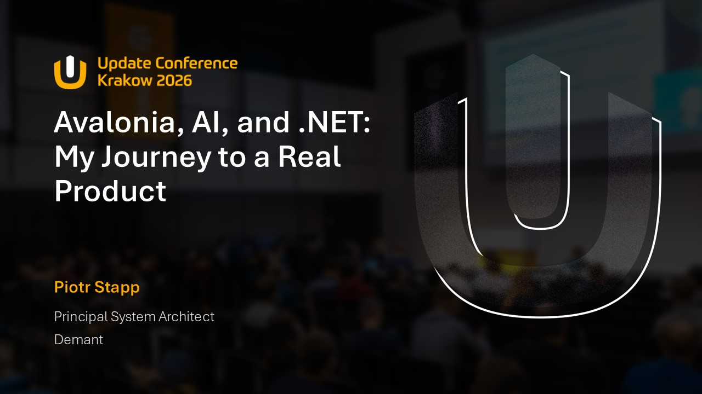
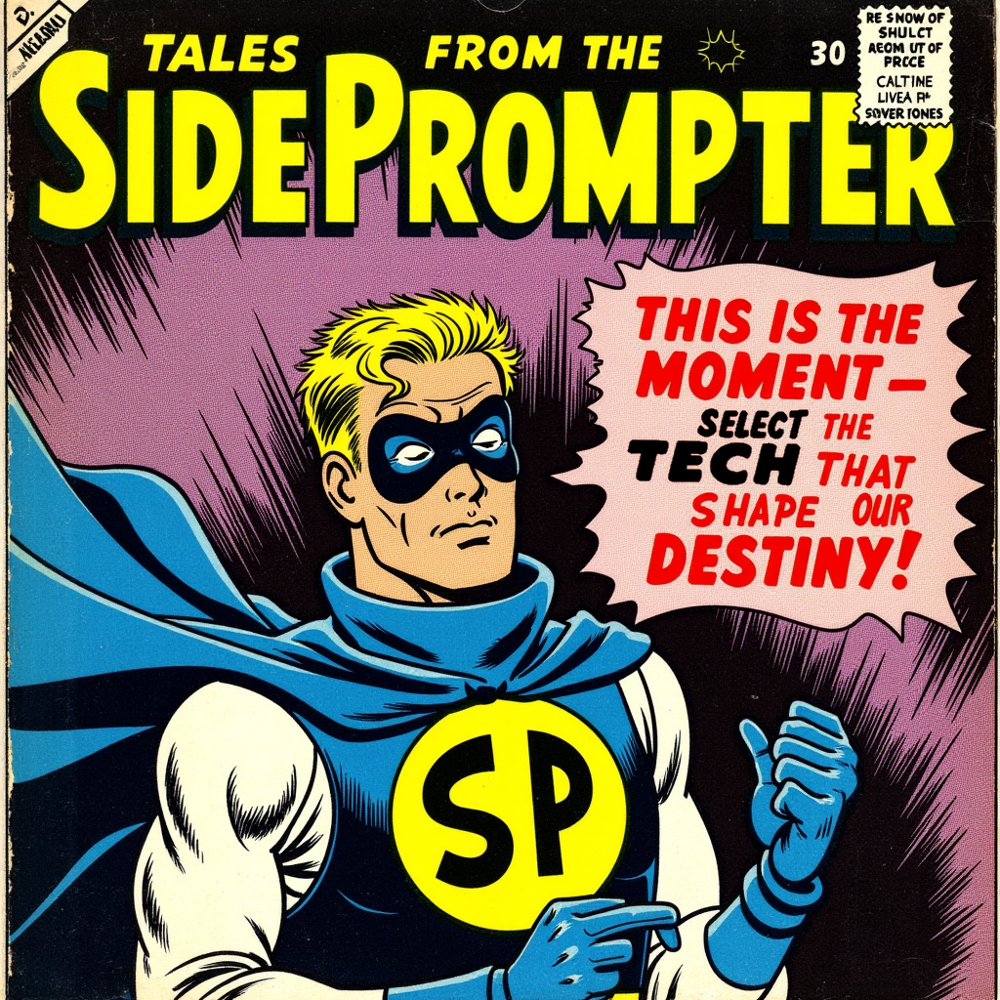
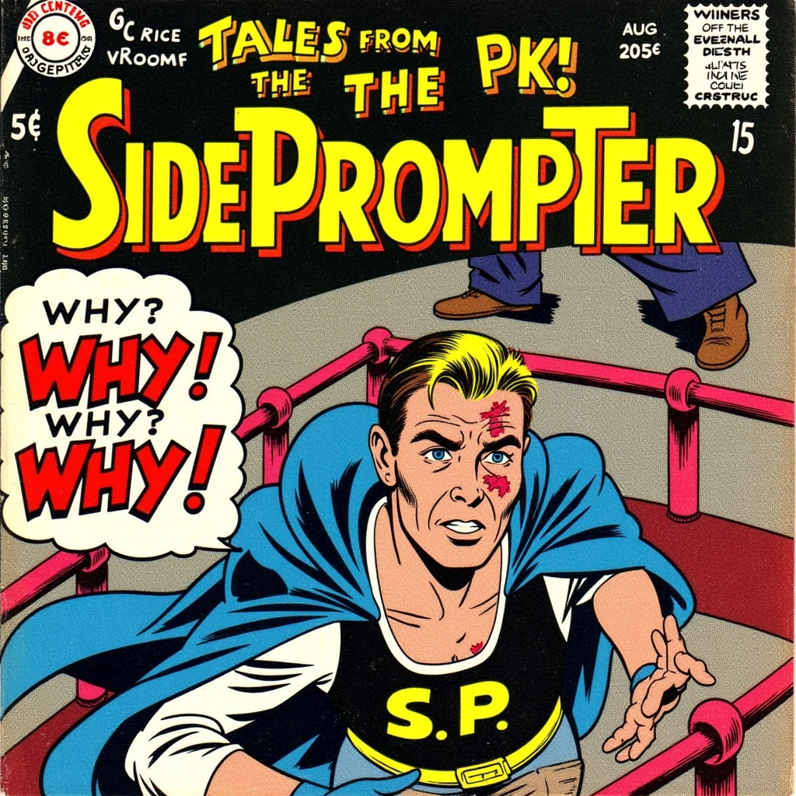
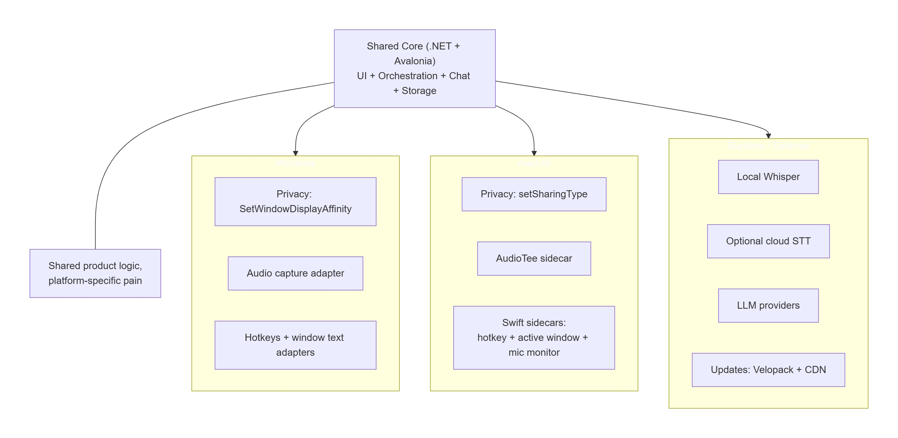
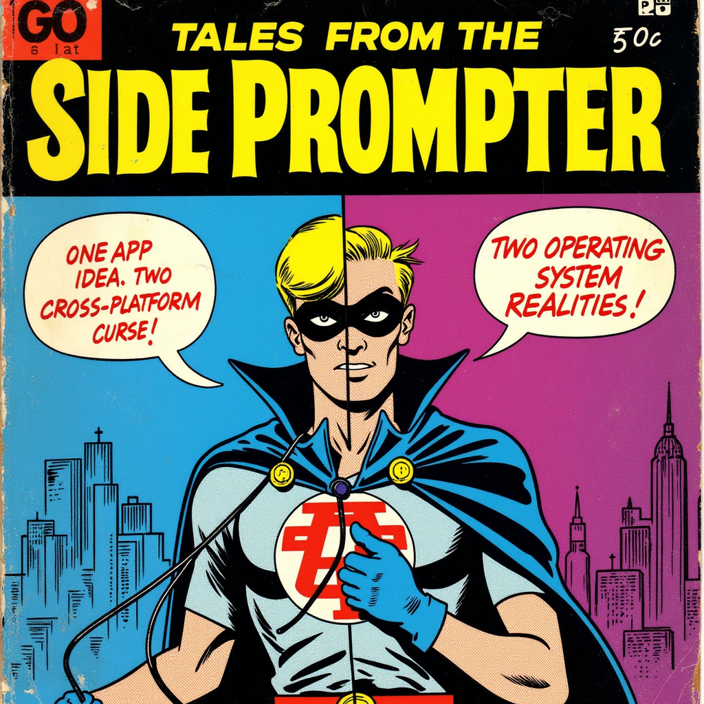
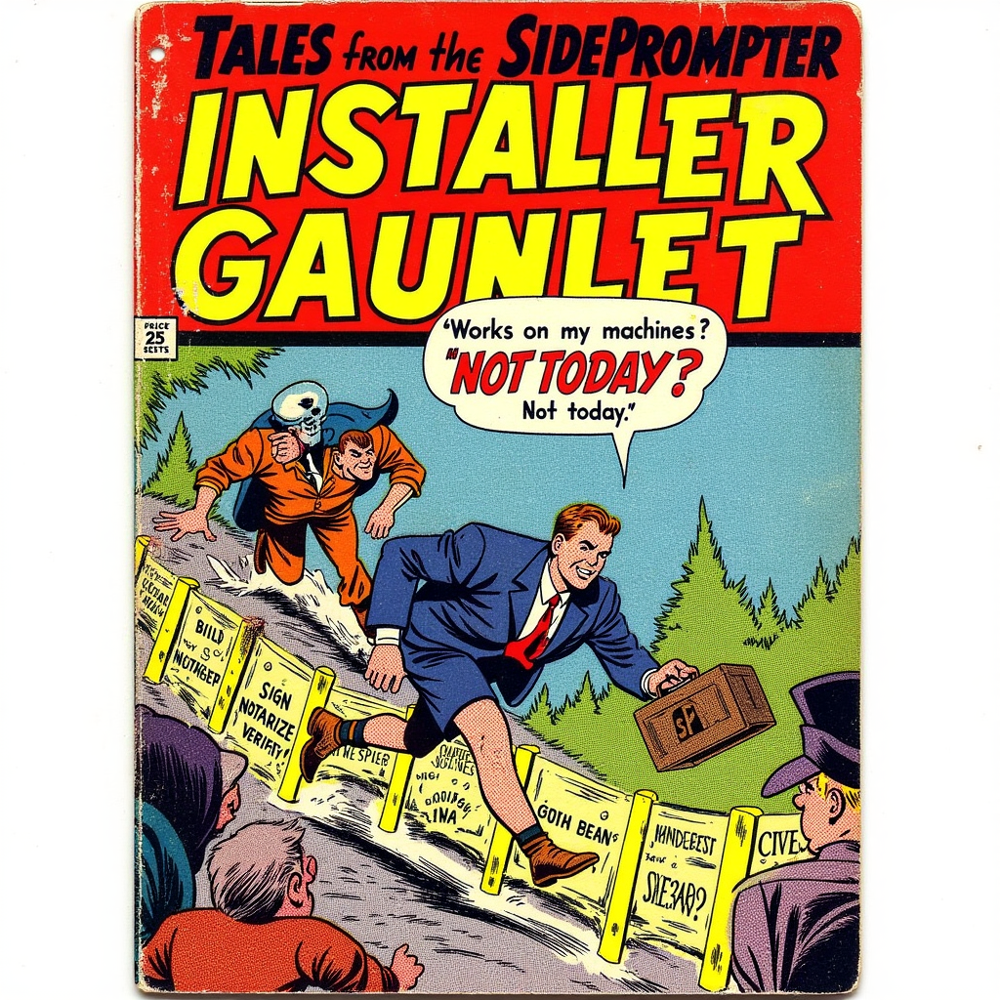
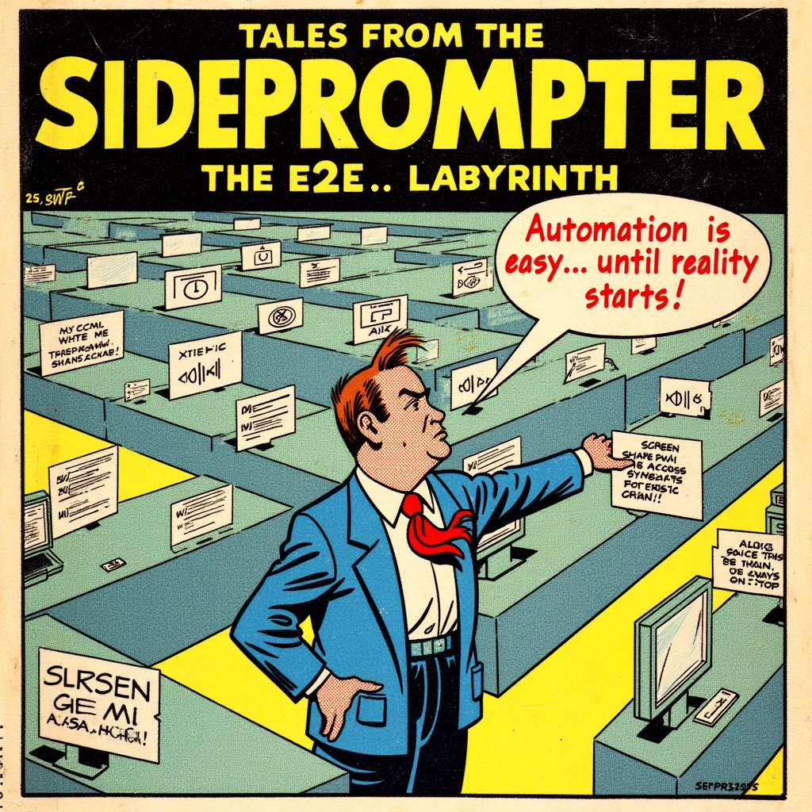
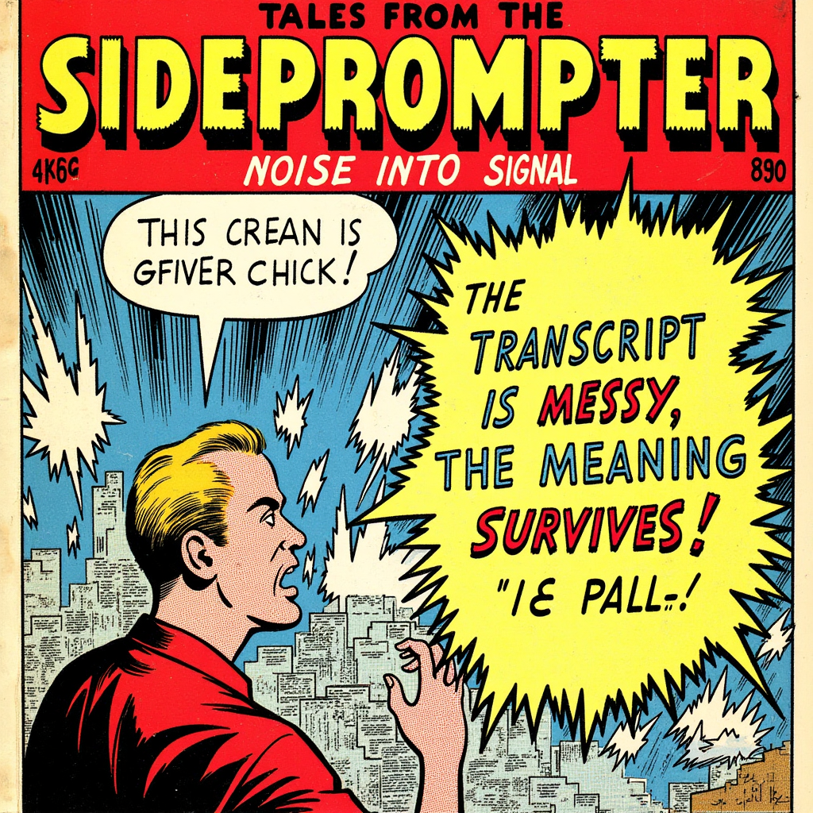
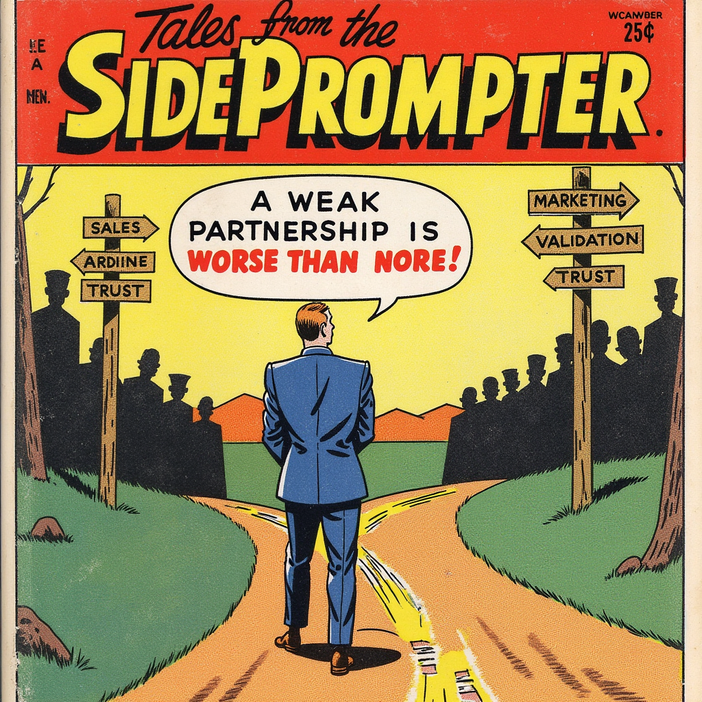
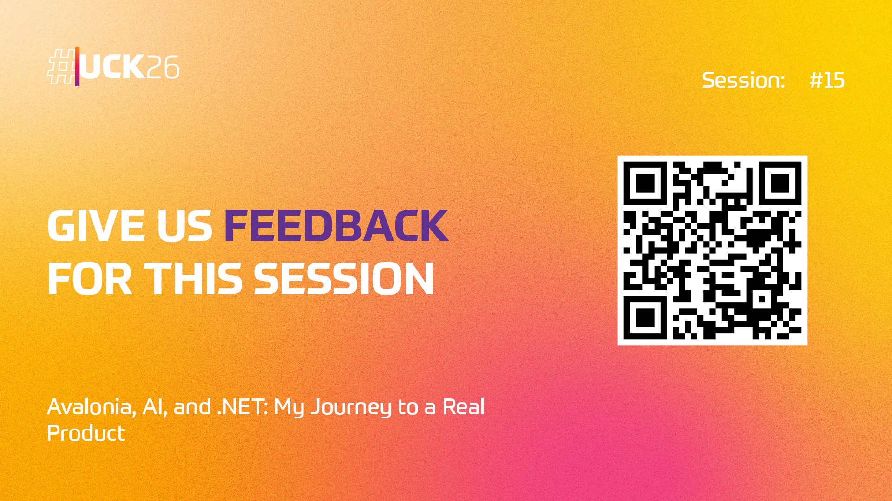

<!--
Notes:
- Open with the social-media promise: "AI will build your app in a weekend."
- Frame this as an experiment, not a victory lap.
- Tell them the punchline early: AI helped a lot, but it did not replace engineering judgment.
-->

---

# Chapter 1
## The story

From hype to a real product experiment.

---

# The experiment

> What if I treat AI like a technical co-founder  
> and ask it to help build a real desktop product?

- Product: **Side Prompter**
- Goal: invisible AI support during video calls
- Constraint: **Windows + macOS**, local transcription, privacy, real UX
- Success bar: not a demo, a product I could actually ship

<!--
Notes:
- Make the audience care about the product before the technology.
- Explain "real product" means distribution, setup, updates, permissions, packaging, and UX.
- Stress that desktop apps are a good stress test for AI coding promises.
-->

---

# What Side Prompter had to do

- Capture microphone and system audio
- Transcribe speech locally in real time
- Send context to an LLM
- Stay out of the screen share
- Support keyboard-driven usage
- Work on both **Windows** and **macOS**

<!--
Notes:
- Slow down here: this slide defines the engineering difficulty.
- Emphasize that each bullet sounds reasonable alone; the combination is what hurts.
- Mention that "not visible during screen share" is the weird requirement that changes everything.
-->

---

# The spark: startup funding hit me hard

I saw **Cluely** raise **$15M (a16z)**.

My reaction:

- "Wait, I already built something similar as a PoC."
- "If this market is real, I should stop treating it like a side toy."
- "Time to test whether this can become a real product."

**That funding news turned curiosity into commitment.**

<!--
Notes:
- Keep this personal and honest, not jealous.
- This is your motivation bridge from idea to execution.
- If useful, name the startup verbally and connect to the market signal.
-->

---

# My starting point

- I already had a tiny PoC
- Around **250 lines** in a .NET console app
- It could:
  - listen to mic + speaker
  - run Whisper locally
  - send feedback to an Azure-hosted model

**So the real challenge was not the idea. It was turning it into a product.**

<!--
Notes:
- This is important: you were not starting from zero.
- It helps explain why AI looked promising: the core concept was already validated.
- Nice place to mention "the hard part starts after the first exciting demo."
-->

---

# Welcome

**Piotr Stapp**  

**Experience in IT:**  20 years+

**Microsoft MVP:** Development Technologies

**Position:**  
System Principal Architect at **Demant**
Global hearing healthcare and audio technology group

**Specialization:**  
Cleaner, Cloud, Code, Infra

**Distinguishing marks:**  
Don't Stapp me now!


<!--
Notes:
- Keep this quick and light.
- End on the tagline before moving back into the product story.
-->

---

# Chapter 2
## AI Chose Tauri. Reality Chose Otherwise

Where recommendation quality met implementation pain.

---

# Where AI was genuinely useful

- It expanded my option space
- It suggested technologies I was not considering
- It helped generate ADRs and comparison matrices
- It was surprisingly good at:
  - prompting me with evaluation criteria
  - documenting trade-offs
  - accelerating boring setup work

**AI was strongest as a research assistant and thought amplifier.**

<!--
Notes:
- Do not sound anti-AI too early.
- Give AI credit where it earned it.
- This creates tension for the later "but then reality hit" section.
-->

---

# I asked AI to write ADRs, not just recommendations

I asked multiple models to formalize the choice (August 2025):

- **Sonnet 3.7**
- **Sonnet 4**
- **GPT-5**
- **Gemini 2.5**
- ... and more

<!--
Notes:
- This makes the process look disciplined, not vibes-based.
- Mention that AI was useful for creating decision records, comparison criteria, and explicit trade-offs.
- There was at least one outlier, but the overwhelming direction was still Tauri.
-->

---

# Sonnet 4 captured the requirements really well

Sonnet 4 ADR for desktop framework selection framed it like this:

- Windows + macOS
- multiple separate windows
- semi-transparent overlay UI
- hidden during screen sharing
- microphone + speaker access
- local Whisper / AI transcription

**The framing was strong. That part genuinely helped.**

<!--
Notes:
- Emphasize that AI was good at turning fuzzy ambition into concrete decision drivers.
- This is where ADRs added value: they forced the requirements into something reviewable.
-->

---

# GPT-5 pushed the same direction

One GPT-5 ADR argued for:

- **Tauri** as the desktop shell
- OS-level screen-capture protection
- local transcription via **Whisper** / `whisper.cpp`
- lightweight footprint instead of shipping Chromium

**Same answer, with a stronger emphasis on performance and privacy.**

<!--
Notes:
- Useful point: GPT-5 did not just say "Tauri"; it justified it through bundle size, local AI, and content protection.
- This strengthened confidence because it echoed the same trade-offs from a different model.
-->

---

# Gemini 2.5 was also on team Tauri

Gemini 2.5 framed the choice as:

- best balance of **performance**
- best access to **native APIs**
- strong fit for **screen-sharing privacy**
- web UI speed with a Rust backend

**Again: smart logic, clean ADR, same conclusion.**

<!--
Notes:
- Gemini's version was shorter and cleaner, but it reinforced the same architecture choice.
- This is the moment to underline the consensus effect: multiple models, slightly different reasoning, same destination.
-->

---

# Sonnet 3.7 was impressive on paper

**Sonnet 3.7** even created multiple focused ADRs:

- **desktop framework:** Tauri
- **UI:** React + TypeScript
- **audio:** WebAudio + custom Tauri plugins
- **transcription:** Whisper via `whisper.cpp`
- **screen sharing invisibility:** OS window flags via native code

**Architecturally smart.**

<!--
Notes:
- This is the bridge to the next section.
- Say: "The ADR looked coherent. The repo later taught me the missing cost was toolchains, packaging, and native integration pain."
-->

---

# The surprising AI consensus

Nearly every model pushed me toward **Tauri**.

- Electron
- Tauri
- Flutter
- .NET MAUI / Avalonia
- Qt
- Java / Compose

And yet the recommendation kept coming back to:

## **Tauri + Rust + web UI**

<!--
Notes:
- This is a good moment for humor: "I had never heard of Tauri, but AI was already emotionally invested."
- Mention that consensus increases confidence, even when none of the models own the consequences.
- If time allows, say which models you asked: GPT, Claude, Gemini, Perplexity.
-->

---

# Why Tauri looked perfect

- Small binaries
- Good performance
- Strong story for security
- Web UI for fast iteration
- Native access through Rust
- Great fit for:
  - transparent windows
  - multi-window apps
  - screen-capture protection

**On paper, it was a beautiful answer.**



<!--
Notes:
- This slide should feel convincing.
- You want the audience to believe the choice before you break it.
- Keep the tone: this was not a stupid choice; it was a rational one.
-->

---

# And to be fair: the Tauri PoC worked

From the repo, the PoC validated **4 of 6** key requirements:

- Windows + macOS path looked viable
- Multiple windows
- Semi-transparency
- Hidden during screen sharing

Still unresolved:

- audio capture
- local transcription integration



<!--
Notes:
- This keeps the story honest: Tauri was not fake success.
- Mention the specific Windows API: SetWindowDisplayAffinity.
- The problem was not "Tauri is bad." The problem was the last 20% was the actual product.
-->

---

# Then reality arrived as C++ dependency pain

To get `whisper_rs` working, I ran into:

- Visual Studio Desktop C++
- CMake
- LLVM / Clang
- optional CUDA
- CI/CD questions I had ignored

**A smart architectural answer became a brutal toolchain answer.**

<!--
Notes:
- This is one of the central lessons: architecture choices are not just runtime choices.
- Say clearly: "developer experience includes build pipelines, packaging, and native dependencies."
- If you want a laugh line: "I downloaded half the internet and still did not have a product."
-->

---

# AI helped me choose Tauri
# AI did not help me survive Tauri

- It understood the comparison table
- It did **not** understand the day-2 friction
- It kept underestimating:
  - native toolchains
  - packaging complexity
  - CI pain
  - my actual ability to debug Rust + C++ + macOS audio

**This was the first big crack in the "AI co-founder" fantasy.**

<!--
Notes:
- Say this slowly. It's one of the strongest talk lines.
- The point is not that AI is dumb; the point is that it is weak on situated, messy engineering reality.
- This is a natural transition from stack selection to problem framing.
-->

---

# The deeper problem: I was solving the wrong thing

For macOS system audio, AI kept steering me toward:

- microphone APIs
- BlackHole
- partial answers

But the real lesson was:

## **wrong problem framing beats wrong programming language**

<!--
Notes:
- This slide should feel like the emotional low point.
- Explain that Windows success misled you into using the wrong mental model for macOS.
- Great place to say: "The issue was not Rust vs .NET. The issue was that I did not understand the platform."
-->

---

# Chapter 3
## The Avalonia Pivot

From frustration to a stack I could actually ship.

---

# My panic pivot

1. I got frustrated with Rust.
2. I ran back to .NET.
3. I tried **.NET MAUI**.
4. A few hours later: **Mac Catalyst is not the macOS app experience I needed.**
5. Only then did I try **Avalonia**.

**Sometimes the best architecture review is pain.**

<!--
Notes:
- Keep this human and slightly self-deprecating.
- This is a good place to acknowledge community input: Avalonia was suggested before you were ready to hear it.
- The audience should feel the emotional swings of the journey.
-->

---

# What is Avalonia (and why I tried it)?

- Open-source, cross-platform UI framework for .NET
- Uses C# + XAML
- Supports Windows, macOS, Linux
- Feels familiar if you know WPF/UWP/XAML-style thinking
- Lets me stay in one language/tooling mindset

**For this project, Avalonia was the "pragmatic productivity" choice.**

<!--
Notes:
- Keep this short: it's an orientation slide, not a framework deep-dive.
- Emphasize developer ergonomics and delivery speed, not benchmark wars.
- Transition line: "I didn’t need the perfect framework; I needed one I could ship with."
-->

---

# The actual breakthrough

The answer was not "write more native code."

The answer was:

## **use sidecars (with CLI) for platform-specific pain**

- `AudioTee` for macOS audio capture
- helper binaries for hotkeys and active-window text
- keep the app simple, isolate the ugly parts

**That pattern mattered more than the framework switch.**

<!--
Notes:
- This is an important design lesson, not just an implementation detail.
- Explain the sidecar pattern in one sentence: separate process, narrow responsibility, clean boundary.
- Good moment to say "sometimes the best code is code you do not own."
-->

---

# Why Avalonia won

- Simpler mental model for me
- Productive in familiar **C# / .NET**
- Good enough cross-platform UI
- Easy to stop asking AI for critical code
- Better fit for "I need to finish this"

**Avalonia was not the most hyped option. It was the most useful one.**

<!--
Notes:
- This is one of the talk's headline messages.
- Phrase it as a pragmatic win, not a framework war.
- "Good enough" is a powerful phrase here.
-->

---

# Chapter 4
## How the Product Actually Works

Current architecture, capabilities, and demo setup.

---

# What the repo shows today

- **Avalonia 11** on **.NET 9**
- Local Whisper via `Whisper.net`
- Selectable local model sizes
- OpenAI-compatible chat providers:
  - OpenAI
  - OpenRouter
  - Ollama
  - custom endpoints
- Window privacy on Windows and macOS
- Setup wizard, updates, packaging, chat history

<!--
Notes:
- This is where you prove the product became real.
- Mention the repo has update feeds, setup flow, settings, session history, and platform services.
- If demoing later, this is the bridge slide.
-->

---

# Side Prompter architecture



**Shared logic, platform-specific pain.**

<!--
Notes:
- Keep this as a map slide, not a deep implementation walk-through.
- Narrate left-to-right: shared core -> platform adapters -> runtime services.
-->

---

# Pattern 1: runtime routing in shared code

```csharp
public static void SetProtected(Window? window, bool protect)
{
    if (window is null) return;

    if (OperatingSystem.IsMacOS())
        SetProtectedMac(window, protect);      // NSWindow setSharingType
    else if (OperatingSystem.IsWindows())
        SetProtectedWindows(window, protect);  // SetWindowDisplayAffinity
}
```

**Idea:** one shared API, platform-specific adapters behind it.

<!--
Notes:
- This is the first cross-platform pattern: runtime OS switch in shared logic.
- Keep it short and concrete.
-->

---

# Pattern 2: platform regions in build + files

```xml
<!-- AvaloniaApp.csproj -->
<PropertyGroup Condition="$([MSBuild]::IsOSPlatform('Windows'))">
  <TargetFramework>net9.0-windows</TargetFramework>
</PropertyGroup>
<PropertyGroup Condition="$([MSBuild]::IsOSPlatform('OSX'))">
  <TargetFramework>net9.0-macos</TargetFramework>
</PropertyGroup>
```

```csharp
#if MACOS || OSX
// WindowTextExtractionService.Mac.cs
#endif
// WindowTextExtractionService.Win.cs
```

**Idea:** split by OS at build/file level (`*.Mac.cs`, `*.Win.cs`).

<!--
Notes:
- This is the second pattern: compile-time/file segmentation.
- Together with Pattern 1, it explains the full platform strategy.
-->

---

# DEMO

<!--
Notes:
- This is your practical demo script.
- Start Side Prompter during a fake call.
- Show the floating window.
- Start screen sharing.
- Show that the app disappears from capture.
- Speak badly on purpose.
- Show weak transcription but still useful LLM output.
- Open settings and switch model/provider.
- This demo tells the whole story in 3 minutes.
- The best version is short and slightly risky: show the weird feature first.
- If the live demo feels dangerous, record this exact sequence as a backup video.
- Demo package (live + fallback):
  - Live path (primary):
    1. Open app + quick setup context
    2. Enable/confirm privacy mode
    3. Start screen share
    4. Prove window is hidden from capture
    5. Speak noisy sentence intentionally
    6. Show imperfect transcript + useful AI answer
  - Fallback path (if live fails):
    - Pre-recorded clip
    - Backup screenshots for stealth mode, bad transcript, and AI output
-->

---

# Chapter 5
## Shipping Pain: Cross-Platform, Installer, E2E

The part nobody sees in product screenshots.

---

# How the "invisible during screen sharing" trick works

- **Windows:** `SetWindowDisplayAffinity(..., WDA_EXCLUDEFROMCAPTURE)`
- **macOS:** `NSWindow setSharingType:` to hide from capture
- Wrapped in a cross-platform service
- Simple API
- Very non-simple testing story

**Same feature. Two different operating systems. Two different truths.**

<!--
Notes:
- This is a good code slide candidate.
- Show a tiny code snippet or a split screenshot of the two platform calls.
- The important point is not that the code is long. The important point is that the abstraction is lying a little.
-->

---

# Cross-platform is hard

People say "cross-platform app" as if it means one app.
In practice it means:

- one UI idea
- different permissions
- different audio stacks
- different packaging rules
- different signing/notarization pain
- different failure modes

## Cross-platform is often "shared ambition, platform-specific suffering"



<!--
Notes:
- This is one of your strongest opinion slides.
- You can say "almost bullshit" verbally if you want more energy.
- Clarify that the lie is not in the framework; it is in the expectation of equal difficulty.
-->

---

# The installer story was its own project

- It was not "build once, ship everywhere"
- It became a release engineering project
- Platform differences dominated late-stage work
- The packaging approach evolved during the journey
- Final direction: **Velopack-centered** distribution flow

**Shipping is where "works on my machine" finally gets punished.**



<!--
Notes:
- This came straight out of the commit history.
- Mention the separate macOS signing identities and the universal launcher wrapper.
- Good contrast: framework debates are sexy, installer work is real.
-->

---

# What is Velopack (in one slide)?

- A packaging + update framework for desktop apps
- Creates distributable releases per platform
- Supports update feeds/channels
- Lets the app check, download, and apply updates
- In this project: used as the release backbone

**Why it mattered:** one consistent release/update model instead of ad-hoc packaging.

<!--
Notes:
- Keep this practical, not a tool advertisement.
- Mention that Velopack appears both in project metadata and update service code.
-->

---

# Windows packaging

- Publish self-contained app
- Package release with Velopack
- Use update feed/channel strategy
- Keep signing/release flow predictable

**Goal:** fewer moving parts than custom installer scripts.

<!--
Notes:
- You can mention older attempts existed, but this is where the project is heading now.
- Keep the message: simplify and standardize release operations.
-->

---

# macOS packaging was the hard part

- Build both `osx-x64` and `osx-arm64`
- Create universal wrapper app
- Bundle helper binaries and resources
- Sign app + nested binaries
- Notarize and verify
- Then pack for distribution

**Same product, much heavier release surface than Windows.**

<!--
Notes:
- This is the "whole story" slide for macOS.
- Mention separate app/install identities and notarization friction.
-->

---

# Installer reality: 7-step gauntlet

1. Build for target runtimes (Windows + macOS split)
2. Prepare app bundle/wrapper (macOS x64 + arm64)
3. Sign app binaries
4. Sign helper binaries (`audiotee`, hotkey, active-window tools)
5. Notarize (macOS trust chain)
6. Verify signatures/notarization
7. Package for distribution (Velopack)

<!--
Notes:
- This is the "shipping is a system, not a command" slide.
- Keep it practical: one sentence per step, no script deep-dive.
- Use this to explain why cross-platform desktop delivery is hard even when code is ready.
-->

---

# Why E2E testing was so hard

Because the product surface is hostile to automation:

- transparent windows
- always-on-top behavior
- hidden-from-capture behavior
- OS permissions
- microphone + system audio
- global hotkeys
- helper binaries
- multi-window desktop UX

**I did not avoid e2e because I hate quality. I avoided fake confidence.**



<!--
Notes:
- The repo currently has product code and build scripts, but no mature e2e suite. That absence is part of the story.
- Explain that browser-style e2e instincts break down on privileged desktop apps.
- If useful, say that the real test matrix included operating system state, not just app state.
-->

---

# Transcription was worse than I expected

- Local transcription is imperfect
- Chunking matters
- VAD (voice activity detection) matters
- speaker/system-audio capture matters
- real conversations are messy

But:

## LLMs often understand noisy transcripts better than humans expect



<!--
Notes:
- This slide sets up a nuanced point: bad raw transcription does not always mean bad product outcome.
- You can show one ugly transcript next to a surprisingly useful AI suggestion.
- Nice place to mention chunking + VAD commits in the repo.
-->

---

# One uncomfortable product lesson

Maybe users do **not** need perfect transcription.

Maybe they need:

- enough context
- timely suggestions
- confidence under pressure
- a system that recovers from messy input

**That changed how I thought about quality.**

<!--
Notes:
- This is a strong product-thinking slide.
- It helps move the talk beyond engineering pain into design insight.
- Good place to say: "Optimize for usefulness, not benchmark beauty."
-->

---

# Chapter 6
## Business Reality

Building software is not the same as building a company.

---

# I tried to find a co-founder

The repo even contains a prompt for a **co-founder interview assistant**.

That tells its own story:

- I used **my own product** during real co-founder conversations
- I knew the business side mattered
- I tried to systematize the conversations
- I still failed to find the right partner

**A product problem is not solved just because the code starts working.**



<!--
Notes:
- This is a very human slide and gives the talk range.
- You are not just building software; you are trying to build a company-shaped thing.
- If you want, connect this to AI again: AI can help you prepare, but it cannot manufacture mutual trust or shared ambition.
-->

---

# Another hard truth: founders search for certainty

Prompt excerpt I used inside Side Prompter:

```text
Role: secret advisor and second brain in real time.
Goal: help me evaluate a non-technical co-founder candidate.
Watch for red flags: vague advice, no concrete actions, low energy.
Suggest next questions on market validation, sales, and go-to-market.
Format: short, actionable bullet points.
```

<!--
Notes:
- Keep this slide focused only on how you used the product in a real business scenario.
- Read just 2-3 lines from the excerpt, not the whole block.
-->

---

# What I wanted vs what I learned

I wanted a non-technical co-founder to handle:

- sales
- marketing
- community
- validation

But what I really learned was:

- clarity is hard
- founder fit is rare
- momentum matters
- a weak partnership is worse than no partnership

<!--
Notes:
- This can become one of the most memorable non-technical moments in the talk.
- If you have a specific failed pattern, add it here: too vague, too early, too little traction, different motivation, etc.
- This is a great place for honesty without oversharing.
-->

---

# The "real product" details people forget

- macOS permissions
- helper binaries
- installer issues
- update channels
- model downloads
- active-window context extraction
- hotkeys
- storing chat sessions safely

**The app is real when the unglamorous parts dominate your week.**

<!--
Notes:
- Strong pragmatic slide.
- This is where you distinguish shipping from prototyping.
- Use the installer struggle story for texture.
-->

---

# Chapter 7
## What I’d Repeat, What I’d Avoid

Practical rules after building and shipping.

---

# Local vs cloud: what I learned

## Speech-to-text

**Local Whisper wins** when I care about:

- privacy
- offline usage
- predictable cost
- product control

<!--
Notes:
- Keep this balanced and practical.
- Do not oversell a universal answer.
- Mention the repo now contains both local Whisper and a cloud transcription option, which reflects this trade-off.
-->

---

# Local vs cloud: where cloud still wins

## Speech-to-text

**Cloud services win** when I care most about:

- instant setup
- managed accuracy improvements
- less client-side complexity

**My current rule:** optimize for product constraints, not ideology.

<!--
Notes:
- This is the companion slide to keep pacing and readability.
- Keep it pragmatic: both options are valid, context decides.
-->

---

# Big models vs smaller local models

My current view:

- Large cloud models are still better general-purpose partners
- Smaller local models become interesting when:
  - latency matters
  - privacy matters
  - cost matters
  - the task is narrow enough

**The winning pattern is usually not ideology. It is routing.**

<!--
Notes:
- Since the repo supports OpenAI-compatible providers and Ollama, this slide can be framed as an architectural direction.
- Avoid pretending the local story is already "won."
- "Routing" is a nice practical term: choose the right model for the job.
-->

---

# These days I'm mostly using Copilot CLI

- It fits how I actually work: terminal, repo, iteration
- It is fast for ADRs, refactors, and repo-wide changes
- It feels more useful than chat-only AI workflows
- But the same rule still applies: I need to stay in control

<!--
Notes:
- Use this as a modern bridge from the project story to your current workflow.
- Nice spoken line: "The experiment changed my tools too. These days I mostly live in Copilot CLI."
-->

---

# So when does Copilot help?

| Helps a lot | Slows me down |
| --- | --- |
| ADR drafts | false confidence |
| refactoring small pieces | wrong problem framing |
| UI scaffolding | native/platform advice with gaps |
| boilerplate | debugging unknown stacks |
| idea expansion | over-produced code I do not trust |

**Copilot is best when I remain the editor, not the passenger.**

<!--
Notes:
- This is likely one of the slides people will photograph.
- Deliver it crisply.
- If you want, name the talk section aloud: "AI as assistant, not substitute architect."
-->

---

# My updated heuristic

1. Use AI to widen the search space.
2. Use AI to accelerate routine implementation.
3. Distrust AI most when stakes are platform-specific.
4. Prefer boring technology when product pressure is real.
5. Do not outsource problem framing.

<!--
Notes:
- This is the practical payoff slide.
- Each line can become a short anecdote if you need to stretch or compress timing.
- Good place to transition toward closing.
-->

---

# The uncomfortable conclusion

AI did **not** build my app in a weekend.

But it did help me:

- start faster
- explore more options
- document decisions
- recover from blank-page moments

And it also forced me to remember:

## **the developer's job is still to understand the problem**

<!--
Notes:
- This is the emotional close.
- Keep the tone calm, not dramatic.
- The talk should land as honest, mature, and useful.
-->

---



<!--
Notes:
- End short.
- After this, move into Q&A.
- Optional closing line: "I did not get an AI co-founder. I got a very fast intern with infinite confidence."
-->
